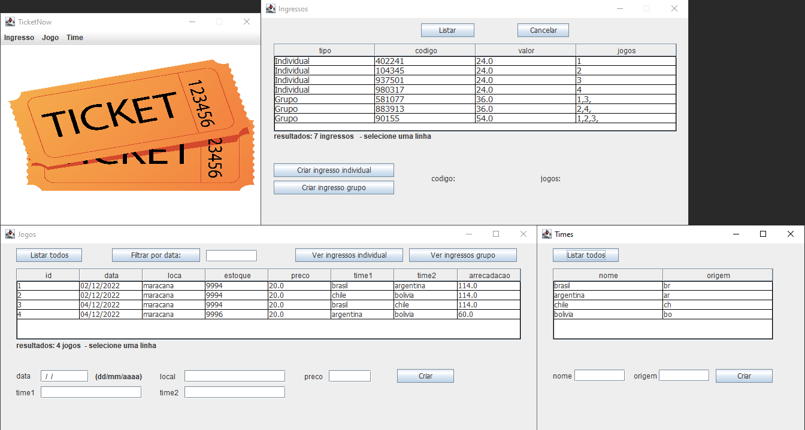

# TicketNow
 Segundo projeto realizado na disciplina de Programação Orientada a Objeto, envolvendo herança, polimorfia e aplicação gráfica em Swing.

 Integrantes: Gabriel Macaúbas Melo, Louise Fernandes Caetano e Samuel de Morais Lima.

